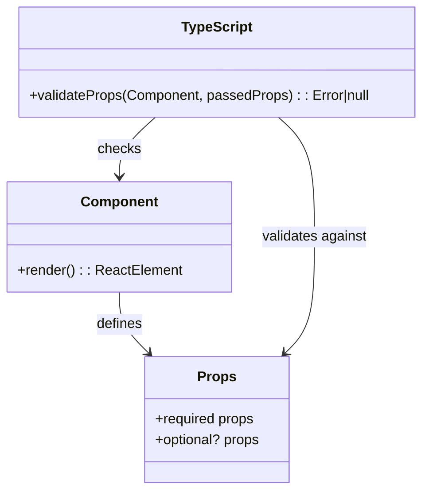
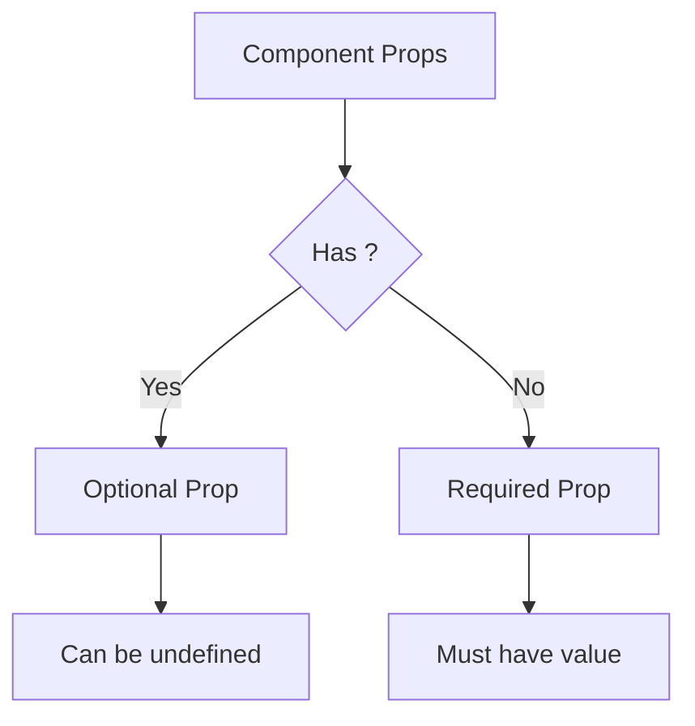
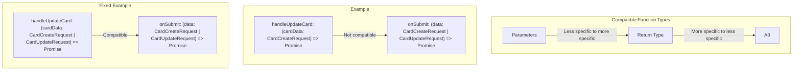
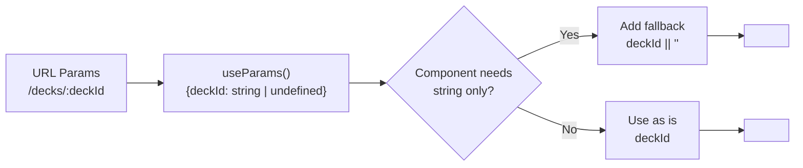
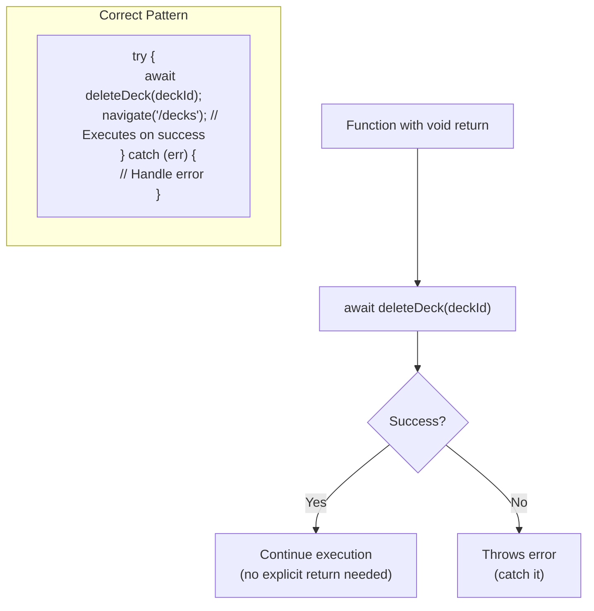

# Understanding TypeScript Errors in React Components

This guide explains common TypeScript errors we encountered in our Flashcard application and how to fix them. These concepts will help you avoid similar mistakes in the future.

## Table of Contents

1. [Props Type Checking](#props-type-checking)
2. [Optional vs. Required Props](#optional-vs-required-props)
3. [Function Signature Compatibility](#function-signature-compatibility)
4. [Handling URL Parameters](#handling-url-parameters)
5. [Void Return Types](#void-return-types)
6. [Common TypeScript Errors and Solutions](#common-typescript-errors-and-solutions)

## Props Type Checking

### What We Learned

TypeScript strictly checks the props passed to React components against their defined interfaces. When a component defines its props with an interface like:

```typescript
interface CardFormProps {
  deckId: string;
  initialValues?: Card;
  onSubmit: (data: CardCreateRequest | CardUpdateRequest) => Promise<any>;
  isLoading: boolean;
  error: string | null;
  mode: 'create' | 'edit';
}
```

Any component using `CardForm` must provide all required props with the correct types.

### Visual Representation



## Optional vs. Required Props

### What We Learned

In TypeScript interfaces, props with a question mark (?) are optional, while those without are required:

```typescript
interface RegisterFormProps {
  onSuccess?: () => void;  // Optional prop
  onError?: (errorMessage: string) => void;  // Optional prop
}
```

### Visual Representation



## Function Signature Compatibility

### What We Learned

Function props must match their expected signatures. For example:

```typescript
// Error case:
// The component expects:
onSubmit: (data: CardCreateRequest | CardUpdateRequest) => Promise<any>;

// But we provided:
handleUpdateCard: (cardData: CardCreateRequest) => Promise<void>
```

The error occurred because:

1. The parameter type is more restrictive (`CardCreateRequest` vs. `CardCreateRequest | CardUpdateRequest`)
2. The return type is more specific (`Promise<void>` vs. `Promise<any>`)

### Visual Representation



## Handling URL Parameters

### What We Learned

React Router's `useParams()` hook returns parameters with type `string | undefined` because they might not always be present in the URL. When passing these to components that expect a strict `string` type, we need to provide a fallback:

```typescript
// Error case:
<CardList deckId={deckId} deckName={deck.name} />

// Fixed:
<CardList deckId={deckId || ''} deckName={deck.name} />
```

### Visual Representation



## Void Return Types

### What We Learned

Functions with a void return type don't return a value that can be used in conditionals:

```typescript
// Error case:
const success = await deleteDeck(deckId);
if (success) { // Error: An expression of type 'void' cannot be tested for truthiness
  navigate('/decks');
}

// Fixed:
await deleteDeck(deckId);
navigate('/decks');
```

### Visual Representation



## Common TypeScript Errors and Solutions

### 1. Property does not exist on type

**Error:**

```
Property 'loading' does not exist on type '{ decks: Deck[]; currentDeck: Deck | null; isLoading: boolean; ... }'
```

**Cause:** Using a property name that doesn't exist in the returned object/type.

**Solution:** Check the actual property name provided by the object/hook (`isLoading` instead of `loading`).

### 2. Type is not assignable to parameter

**Error:**

```
Type '(cardData: CardCreateRequest) => Promise<void>' is not assignable to type '(data: CardCreateRequest | CardUpdateRequest) => Promise<any>'
```

**Cause:** Function signature mismatch, often with parameter type or return value.

**Solution:** Update function signatures to match expected types (broader parameter types, more general return types).

### 3. Missing required properties

**Error:**

```
Type '{ onSuccess: () => void; onError: (errorMessage: string) => void; }' is not assignable to type 'IntrinsicAttributes'.
Property 'onSuccess' does not exist on type 'IntrinsicAttributes'.
```

**Cause:** Component missing interface definition for its props.

**Solution:** Define a props interface for the component:

```typescript
interface RegisterFormProps {
  onSuccess?: () => void;
  onError?: (errorMessage: string) => void;
}

const RegisterForm: React.FC<RegisterFormProps> = ({ onSuccess, onError }) => {
  // ...
}
```

### 4. Type 'undefined' is not assignable to type 'string'

**Error:**

```
Type 'string | undefined' is not assignable to type 'string'.
  Type 'undefined' is not assignable to type 'string'.
```

**Cause:** Trying to pass a potentially undefined value to a prop that requires a non-nullable string.

**Solution:** Provide a fallback value with the OR operator (`||`):

```typescript
<CardList deckId={deckId || ''} deckName={deck.name} />
```

### 5. Testing void expressions for truthiness

**Error:**

```
An expression of type 'void' cannot be tested for truthiness
```

**Cause:** Trying to use a void-returning function's result in a condition.

**Solution:** Don't check the return value; instead rely on successful execution vs. caught exceptions:

```typescript
try {
  await deleteDeck(deckId);  // No return value to check
  navigate('/decks');  // This executes on success
} catch (err) {
  // Handle error
}
```

### 6. Extra props

**Error:**

```
Type '{ cards: Card[]; deckId: string; deckName: string; }' is not assignable to type 'IntrinsicAttributes & CardListProps'.
  Property 'cards' does not exist on type 'IntrinsicAttributes & CardListProps'.
```

**Cause:** Passing props that don't exist in the component's props interface.

**Solution:** Only pass props defined in the component's interface.

## Best Practices

1. **Define clear interfaces** for component props
2. **Make props optional** (with `?`) when they're truly optional
3. **Use consistent naming** across your app (e.g., `isLoading` vs `loading`)
4. **Handle potentially undefined values** from hooks like `useParams()`
5. **Don't test void expressions** for truthiness
6. **Check function signatures** for compatibility
7. **Look at the component definition** before passing props

By following these best practices, you'll avoid common TypeScript errors in React applications.
